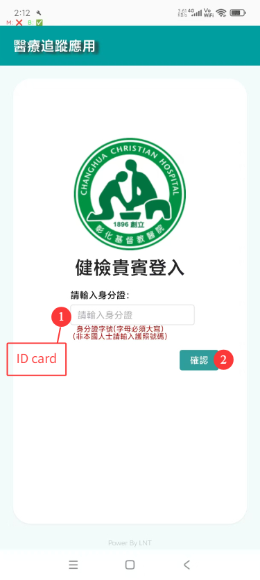
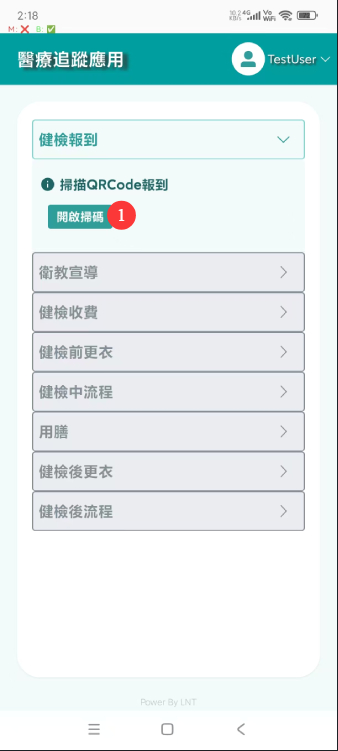
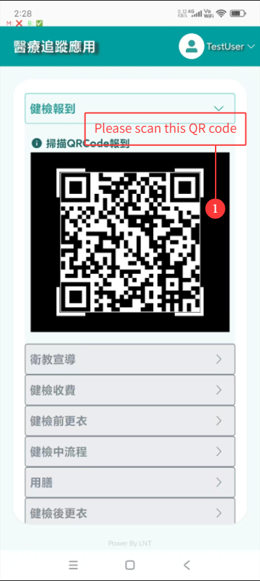
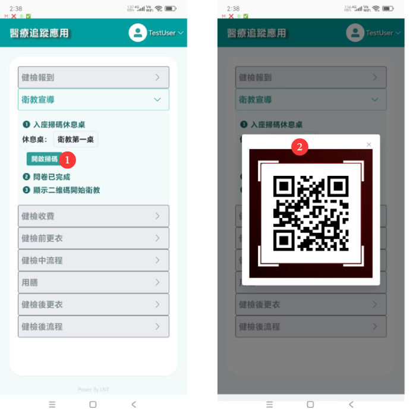
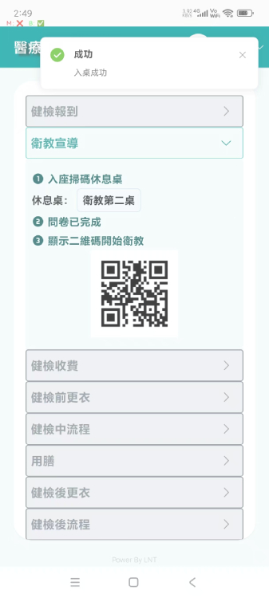
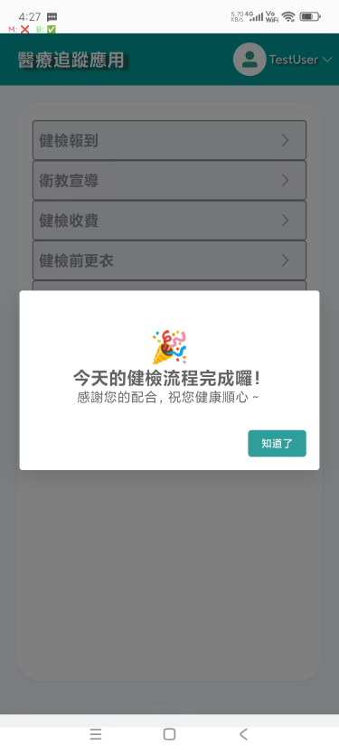

Dear Reviewer,

Hello! Below is a description of the usage process for this app.

This app works in conjunction with the medical system. Some operations, such as scanning, require interaction with the medical system. All such operations are simulated using APIs. Thank you for your understanding.

Step 1:
Log in to the app using an account. Since the actual login uses the resident ID card, no password is required.
After entering the test account in the middle, click "Login" to enter the system.

Step 2:
After entering the homepage, click "Enable Scanning" to scan the check-in QR code (the QR code is located in the folder).

Below is the interface after clicking "Enable Scanning," as well as the QR code that needs to be scanned (also located in the folder: qrcodeMaterial => step1 => Health Check-In QRCode).

After completion, the process will proceed to the next step—health education promotion—and this page will be closed.

Step 3:
Upon entering the health education promotion process, a default rest table will be provided. Actual patients can also choose other rest tables. The QR codes for the rest tables are located in the folder (also in qrcodeMaterial => step2; any one of them can be scanned).
Below is the health education promotion page, the interface after clicking "Enable Scanning," and the QR code that needs to be scanned.

Afterward, the patient’s personal QR code will appear, which needs to be scanned by the medical system. Since the reviewer may not have access to the medical system, this operation is completed using an API.
The normal page is as follows:

The payment step is determined at the hospital, where the patient decides whether to add additional体检 items. This is handled by the nursing staff in the medical system. By default, no payment is required, so this step is skipped.

Step 4:
Changing clothes before the health check. The page is as follows:

The hospital changing room has hardware equipment for scanning:

A QR code to enter the changing room.

A "Open Locker" button to open the patient’s storage locker.
No further action is required here.

Proceed to the next step: the health check process.
The page is as follows:

Click "Self Check-In" to open the QR code scanner (the QR codes are located in the folder: qrcodeMaterial => step3). All QR codes need to be scanned. Please scan one code, wait for the check item status to change to "Completed," and then scan the next one. Thank you.

This part is also handled in the medical system. After self check-in, the medical system will call the number, perform the check, and mark the check as completed. All these operations are simulated using APIs. Thank you for your understanding.

The scanning status is as follows:

After scanning is completed, the status will change to "Completed":

After all checks are completed, the nursing staff will use medical equipment to notify the patient that they can proceed to change clothes (this is also handled by the medical system, so APIs are used to simulate the medical system operations. Thank you for your understanding).

The meal break process is for the lunch break. If the patient has not completed all checks, the hospital nursing staff will arrange for the patient to take a meal break through the medical system. No operation is required here.

Below is the page for entering the changing room:

Similar to the previous changing process, the hospital has hardware equipment for scanning the QR code to enter the changing room and clicking "Open Locker" to open the storage locker. Therefore, no demonstration is required here. Thank you for your understanding.

Simply click "Complete Changing" to proceed.

After changing clothes, the patient will wait for the nursing staff to notify them through the medical system that all checks are completed and the health check is finished. The patient can then leave (APIs are used here to simulate the nursing staff notifying the patient via the medical system that the health check is fully completed).

After clicking "Complete Changing," the process will enter the final step. The page is as follows:

At this point, the entire process is complete!