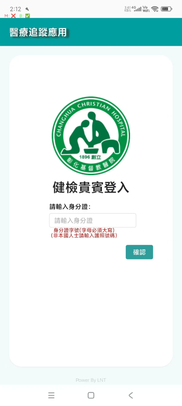
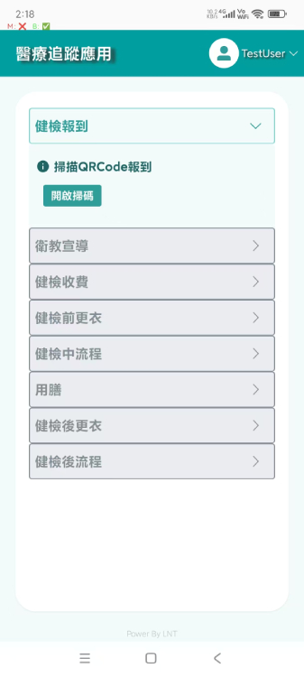
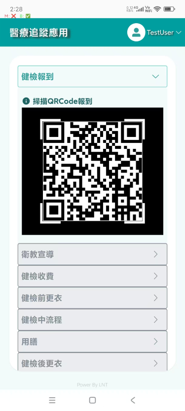
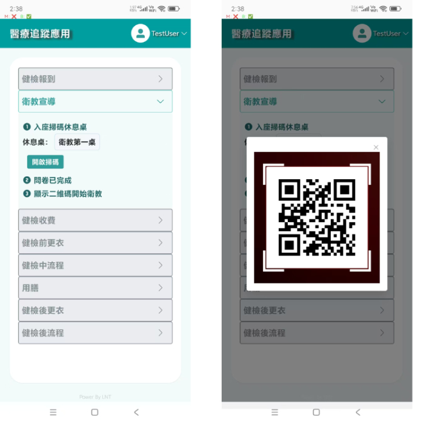
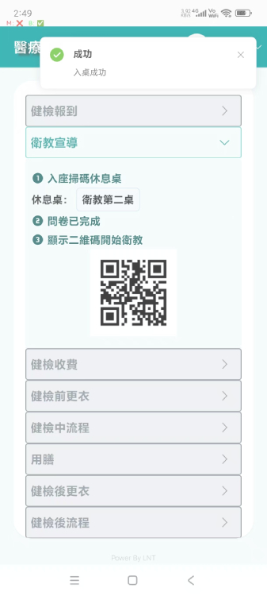
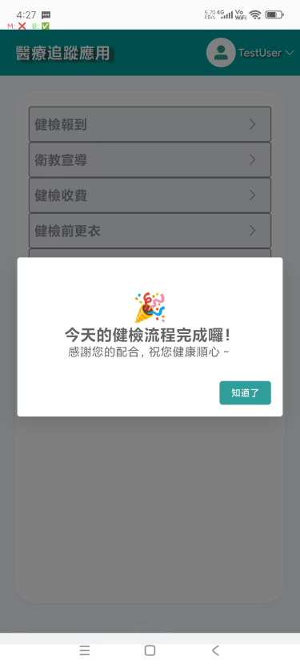

尊敬的審核員，您好！以下是本 APP 的使用流程說明。
 
本 APP 和醫療系統互相搭配使用,其中有些需要醫療系統掃描等操作,皆使用 API 完成模擬操作,謝謝您的理解.

第一步，使用帳號登入本 APP。由於實際使用的是居民身份證，因此無需密碼。
在中間輸入測試賬號之後,點擊登錄即可進入到系統中
 
 

第二步
 
進入到首頁之後,需要點擊開啓掃碼,進行掃碼報到(qrcode 在文件夾)
 

 
 
以下是點擊開啓掃碼之後的樣子,以及所需掃描的 qrcode(也可以在文件夾 qrcodeMaterial => 文件夾 step1 => 健檢報道 QRCode)
 

 
完成之後,會進入到下一流程衛教宣導中,本流程頁面會被關閉.

第三步
進入到衛教宣導流程后,會有一個預設的休息桌, 實際患者可以也可選擇其他休息桌, 休息桌的 qrcode 位於文件夾(也可以在文件夾 qrcodeMaterial = step2 中, 任掃描其一即可)
以下是衛教宣導頁面以及點擊開啓掃碼之後的樣子,以及所需掃描的 qrcode
 

 
之後會出現患者個人的 qrcode 需要醫療系統來掃描 qrcode,由於考慮到審核員沒有醫療系統,所以這裏是使用 API 來完成此操作的
正常頁面如下
 

 
因爲收費這步驟,是患者到醫院以後,由患者確定是否需要加體檢項目來選擇收費,因此是由護理師在醫療系統中確定是否收費,默認是不收費的,因此跳過這流程

第四步 
健檢前更衣, 頁面如下
 

 
醫院更衣室有硬體設備用於掃描 1.qrcode 用於進入更衣室,然後點擊 2.開櫃按鈕打開自己的置物櫃.這裏不做任何操作

開始下一流程進入到健康檢查流程
頁面如下
 

 
點擊自助報到會打開qrcode掃描器(qrcode在文件夾qrcodeMaterial => step3中, 所有的qrocde都需要掃描一次, 請在掃描一次之後等待檢查項目狀態為完成之後再次掃描另一個,謝謝)
 
這部分也是在醫療系統中,自己報道之後, 由醫療系統叫號, 檢查, 檢查完成等流程. 這裏皆使用APi完成醫療系統等操作,謝謝理解
 
掃描狀態如下:
 

 
掃描完成之後: 狀態會變爲完成
 

 
完成所有檢查之後,護理師會使用醫療設備通知患者可以進行更衣步驟(這裏也是醫療系統通知患者,所以也是使用的APi進行醫療系統的操作, 謝謝理解)

用膳流程是因爲中午有休息時間, 如果患者沒有做完檢查, 醫院護理師會在醫療系統上安排患者進行用餐休息.這裏不做操作

以下是進入到更衣頁面
 

 
同前面更衣流程一樣, 在醫院有硬體設備掃描qrcode進入更衣室, 然後點擊開櫃打開置物櫃, 所以這裏不做任何演示, 謝謝理解
 
這裏只需點擊完成更衣即可
 
完成更衣之後,便是等待護理師通過醫療系統告知所有檢查完成,已經結束體檢了.可以離開(這裏會使用醫療系統的API來模擬護理師通過醫療系統來告知體檢全部完成)
 
點擊完成更衣之後, 會進入結束流程. 頁面如下
 

 
至此,所有流程便結束啦